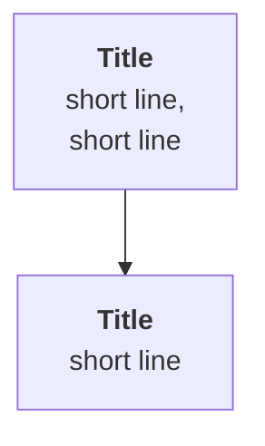

# Unit <id>: <title from phases.yaml>

<One or two sentence standfirst. No heading.>

::: phase learn

## <Beat 1 heading: the concrete scene. No seed words.>

<Open on a place, a time, one named object with an id. Ask a question, leave a line break, answer it. Arithmetic in a ```text block. Why naming the fix now is the trap.>

::: aside <One job, said in the title>
<40 to 90 words.>
:::

::: recap <Title>
<One or two sentences.>
:::

## <Beat 2 heading: the people or the tension. No seed words.>

<Prose. Optional figure, at most 6 nodes:>



::: aside <Title>
<40 to 90 words.>
:::

::: recap <Title>
<One or two sentences.>
:::

## <Beat 3 heading: how to do the thing. No seed words.>

### <Part one>

<Teach against the first rubric criterion. First try, snag, fix, what passes.>

### <Part two>

<Teach against the second criterion.>

::: recap <Title>
<One or two sentences.>
:::

::: phase practice

## <One heading>

<Two or three sentences: read the worked example first, then the drills.>

::: route

::: worked-example

::: workbench

::: retrieval

::: phase build

## <One heading>

<What to write, where to save it, the word budget, the time.>

```text
# <Deliverable title heading>
## <Part heading>
## <Part heading>
```

::: deliverable

::: submission

::: phase verify

## <One heading>

<N checks, all must pass. The exercise page lists them. The grader quotes your words.>

::: prove-it

::: grading-modes

::: rubric

::: phase unstuck

## <One heading>

<One or two sentences.>

::: unstuck

::: phase ask

## <One heading>

<One or two sentences.>

::: ask

::: coda <Title>
<An open invitation to try one more thing. Never a summary. Say it is optional and does not change the checks.>
:::
