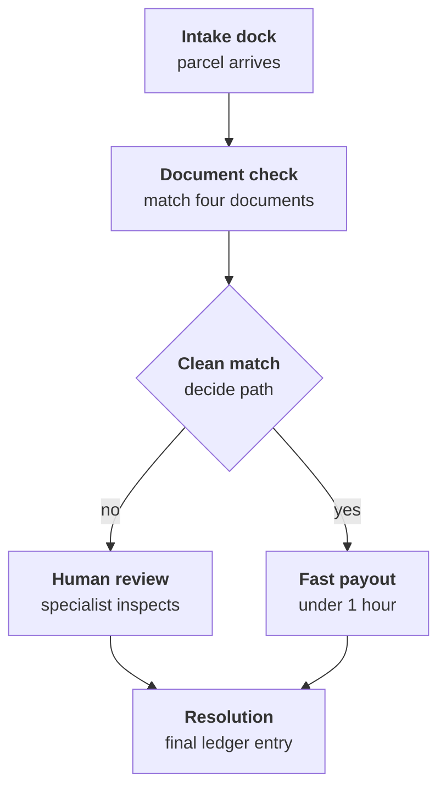

# Unit 0.1: Meet the client: OmniCart Operations

OmniCart Operations ships thousands of parcels each week from its warehouse. When packages arrive late or broken, the intake line stalls.

::: phase learn

## A torn cardboard box at the warehouse

Picture the intake bay at OmniCart Operations on a Tuesday morning.
A courier van drops forty crates onto the concrete floor.
Near the bay door sits order ORD-8821.
Its cardboard box is crushed at one corner, with torn tape.
Inside sits a blue coffee grinder.
A buyer submitted claim CLM-20841 because the glass hopper arrived cracked.
Today, a dispute like this sits on a desk for 2 to 3 days before review begins.
OmniCart handles about 4,000 return requests, damage claims, delivery slips, and payout disputes each month.
With that volume, boxes pile up in aisles and customers send angry messages.

What four documents would you check before paying this refund?
Think about what the buyer ordered, when it arrived, what broke, and what the store promised.

A clerk cannot just guess.
The clerk needs the order receipt to verify what was purchased and paid.
The clerk needs the courier delivery slip to confirm delivery date and address.
The clerk needs the customer unboxing photo to see the cracked glass.
Finally, the clerk needs the 14 day return policy to verify return eligibility.

## Three voices across the executive table

When packages pile up, different leaders feel different pain.
Sarah Jenkins is the VP of Operations.
She watches the queue back up and sees customer ratings drop.
Her goal is simple: cut the review wait from 2 to 3 days down to under 1 hour.
She wants zero lost tickets in the queue.

Across the hall sits the CFO.
Speed sounds nice to the CFO, but sloppy math bleeds money.
When clerks round numbers on thousands of orders, small errors turn into large losses.
The CFO wants every refund tracked in whole integer cents, like 4520 cents.
The CFO also demands audit records that nobody can alter after approval.

Then there is the Trust and Safety Officer.
Neither fast reviews nor tidy math matter if buyers abuse the rules.
The Trust and Safety Officer protects the 14 day return policy against dishonest claims.
Every damage claim must show a clear unboxing photo before payout.
Each leader pulls in a different direction: speed, exact accounting, and strict rules.

::: aside Exact pennies on the ledger
Why not write 45 dollars and 20 cents?
Computers often introduce tiny rounding errors when storing fractions of dollars.
Across about 4,000 monthly cases, those fractional cents add up.
Integer cents avoid rounding entirely.
A refund of 45 dollars and 20 cents is recorded as 4520 cents.
The math stays clean, reproducible, and verifiable.
:::

## Mapping the journey from parcel intake to final settlement

Let us trace what happens when claim CLM-20841 arrives today.
First, a buyer submits the claim online with a photo.
Second, the package sits untouched in the intake queue for 2 to 3 days.
Third, a clerk opens order ORD-8821 and searches for the order receipt.
Fourth, the clerk pulls the delivery slip from the shipping carrier.
Fifth, the clerk inspects the unboxing photo against the return policy.
Sixth, the clerk types the refund into a sheet, often rounding to dollars.
Finally, a manager approves the payout days after the package arrived.

What breaks in this journey?
The long wait is the obvious flaw, but rounding money is equally dangerous.
When steps rely on memory and scattered documents, mistakes happen constantly.

Now let us look at how the journey should work.
Clean claims with matching documents should finish in under 1 hour.
Hard cases, like a blurry photo or a late return, must go to a human specialist.
Every payout records integer cents, such as 4520 cents, in a permanent record.
We describe the business problem in plain words before we choose any fix.

::: recap The intake essentials
We have our bearings now.
OmniCart receives about 4,000 requests each month.
Current cases wait 2 to 3 days on the intake dock.
The target is review in under 1 hour.
Every decision needs four documents: order receipt, delivery slip, unboxing photo, and return policy.
All money is tracked as whole integer cents, like 4520 cents.
:::

::: phase practice

## Study the parallel case

We learn best by seeing a complete example before building our own.
Look at our peer company, Apex Freight Logistics.
Apex is a freight broker in Indianapolis facing similar intake delays.
They review carrier packages with detention slips, bills of lading, and invoices.
Their client brief shows how to organize facts without using forbidden technical words.
Read their document carefully to see how they handle stakeholders, steps, and integer cents.

::: route

::: worked-example

::: workbench

::: retrieval

::: phase build

## Draft the overview document

Now let us write the client brief for OmniCart Operations.
Create your first project document in your text editor.
Save the file to omnicart-system/docs/client-brief.md.
Keep your brief between 250 to 500 words.
Use the five required headings in exact order.
Start with the title: OmniCart Operations: Client Brief.
Then write: The problem, Who cares and why, How it works today, and How it should work.
State the monthly volume of about 4,000 cases and the current wait of 2 to 3 days.
Set your target time to under 1 hour, and record money in whole integer cents like 4520 cents.
Remember the copy rule: zero forbidden technology words.

::: deliverable

::: submission

::: phase verify

## Check every requirement

Before submitting your brief, inspect it against the grading rubric.
Your brief must pass five checks to succeed.
The grader checks for forbidden terms first.
Then it checks your problem statement length, your three leaders, and your step counts.
Finally, it confirms human review for hard cases and integer cents for money.
Take a few minutes to inspect your file line by line against the five checks.

::: prove-it

::: grading-modes

::: rubric

::: phase unstuck

## Common sticking points

Getting stuck on your first brief is completely normal.
Most learners trip on sentence counts or sneak in a banned word.
If your submission fails a check, read the unstuck notes below for quick before and after examples.

::: unstuck

::: phase ask

## Questions that stay open

A good client brief answers key operational questions, but it also raises new ones.
What happens when a delivery slip is missing entirely?
How will clerks handle edge cases that fall outside the 14 day window?
Bring your questions to our community channel and let us discuss them together.

::: ask

::: coda One small experiment with your brief
Try reading your client brief aloud to someone who does not work in logistics.
Can they understand the problem without asking what any term means?
This exercise is completely optional and does not change your score.
It is simply a good way to test how clear your words really are.
:::
