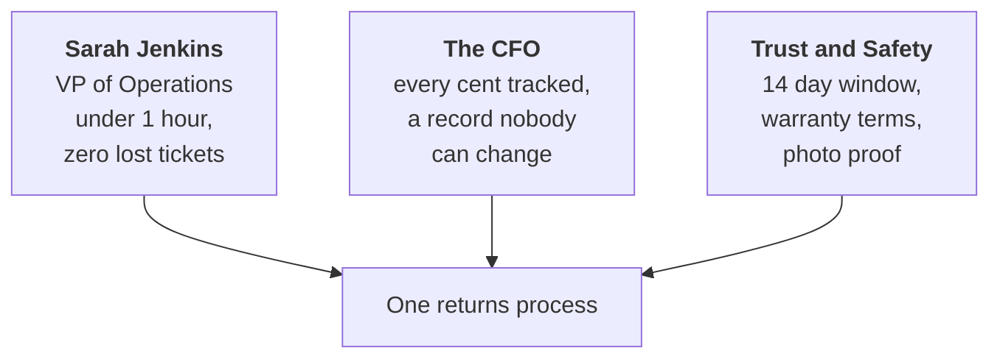
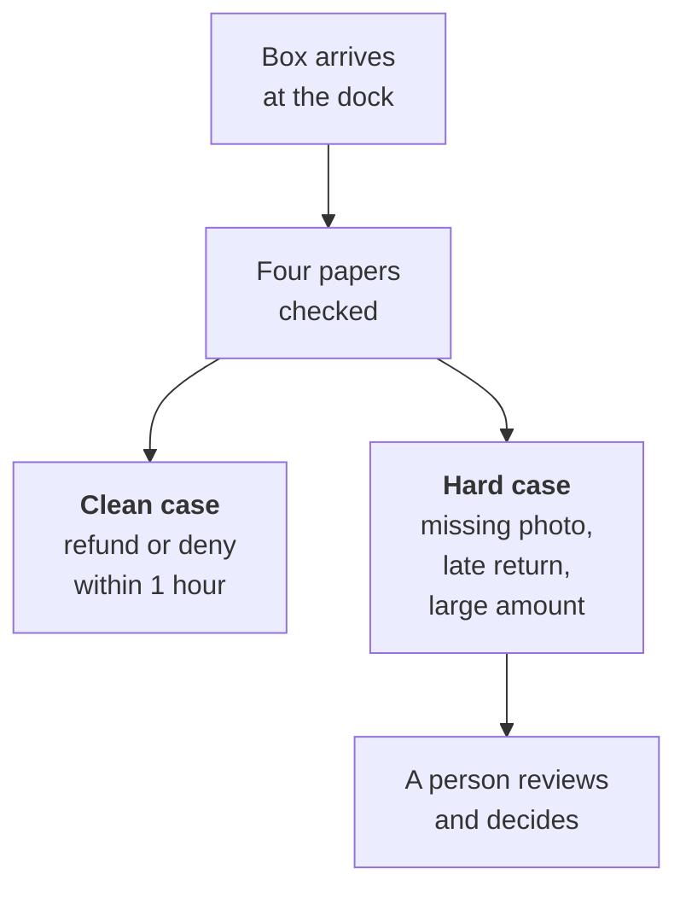

# Unit 0.1: Meet the client: OmniCart Operations

Before we build anything, we meet the people who need it. This unit is one hour of reading and one page of writing.

::: phase learn

## Seven in the morning on the receiving dock

It is 7:00 AM at OmniCart. A truck backs up to the receiving dock. Someone rolls a cart of brown boxes inside. Every box is something a shopper sent back.

Let us pick one box. The label says ORD-8821. Inside is a blender with a cracked lid. Taped to the box is a note from the shopper. The blender arrived broken, and she wants her 4520 cents back. That is 45 dollars and 20 cents, written as whole cents.

A clerk scans the box. The claim gets a number, CLM-20841. Then the box goes on a shelf.

Here is the question. How long does CLM-20841 sit on that shelf before anyone reads the note?

Take a guess before you read on.

Two to three days. A clerk gets to it on Wednesday or Thursday. She opens the order and finds the delivery slip. The delivery slip is the courier's note saying when the parcel arrived. Then she looks for the unboxing photo. The unboxing photo is the picture the shopper takes when she opens the box. Then she checks the return policy. Only then does she decide to refund or deny.

Now, one box is not a crisis. But OmniCart does not get one box.

```text
About 4,000 returns, claims, slips, and disputes each month
Each one waits 2 to 3 days before review begins

4,000 cases x 2.5 days of waiting = 10,000 waiting days a month
That is more than 27 years of waiting, every single month
```

The four kinds of case are return requests, damaged parcel claims, courier delivery slips, and payout disputes.

That number is hard to look at. Let us look at who feels it.

The shopper refreshes her email for three days. The clerk opens a backlog of several hundred cases every morning and never sees the bottom. Somebody in finance cannot finish the month's totals because refunds are still open.

::: aside Why the money is written as whole cents
Look at 4520 again. Two clerks once typed the same refund. One wrote 45.20 and the other wrote 45.2. A third rounded it to 45. Whole cents end that. There is only one way to write 4520. From here on, every amount at OmniCart is whole cents, and the word dollars stays out of the paperwork.
:::

Now, honestly, this is where most of us want to jump. We see the pile and we think, I know what would fix this.

Hold it. Do not write it down yet.

Here is the trap. If we name a fix now, we start describing the fix instead of the problem. Then the fix becomes the thing we defend. And we still cannot say, in plain words, what breaks and who it hurts. You cannot fix what you cannot describe. So for this whole unit, we describe. That is the only job.

::: recap One box, one long shelf
One claim, CLM-20841, waits 2 to 3 days on a shelf. Multiply by about 4,000 a month and the wait is the problem. State the problem in plain words before you name any fix.
:::

## Three people, three finish lines

Let us walk upstairs. Three leaders at OmniCart all say the same thing, that the returns process is broken. Watch what happens when we ask each one what fixed would look like.

Sarah Jenkins runs the day to day work. Her title is VP of Operations. Ask her and she says speed. Under 1 hour from the box arriving to a decision. And zero lost tickets. A ticket is one case in the queue. So no claim ever falls off a shelf for good.

The CFO runs the money. Ask him and he does not say speed at all. He says every cent tracked. Every refund written in whole cents, in a record nobody can change after the fact. If a refund of 4520 cents goes out, he wants to see who approved it and when.

The Trust and Safety Officer keeps OmniCart honest. Ask her and she says rules followed. Every return inside the 14 day return window. Every warranty clause checked. Every damage claim backed by a photo. She would rather a case wait than a fake claim get paid.

::: aside Who the Trust and Safety Officer is
Some papers call this person the policy officer. Same job. She writes the return rules, and she answers when a fake claim gets paid. That is why photo proof matters to her. A photo of the cracked lid turns a story into a fact.
:::

Here is the part that confuses people. Do these three want the same thing?

Take a second.

They do not, and that is the whole point. Speed pulls against checking every rule. Checking every rule takes time. Tracking every cent adds a step to every case. Each finish line is fair. They just sit in different places.



This three way pull has a name. People call it a stakeholder trilemma. A stakeholder is anyone who cares how this turns out. A trilemma is three goals that pull against each other.

A brief that says everyone wants a better process is useless. Nobody can check it. A brief that says Sarah wants under 1 hour and the CFO wants every cent tracked can be checked. Later, every design choice will please one leader and cost another something. Writing down who wants what now is how we avoid that fight later.

::: recap Three leaders, three answers
The VP wants speed, the CFO wants every cent tracked, the policy officer wants rules followed. Write all three down so each one can be checked.
:::

## Follow one box from doorstep to refund

Now we can write. A client brief is one page that says what a company does today and what it should do instead. Ours has four parts under one title. Let us build each part, and I will say what the checks look for.

### Part one: say what breaks

Three sentences or fewer. Two numbers must appear: about 4,000 cases a month, and a wait of 2 to 3 days. Then say who it hurts.

Here is a first try. OmniCart gets a lot of returns and they take too long.

Wait. That has no numbers. A lot and too long cannot be checked. Try again. OmniCart handles about 4,000 returns, claims, slips, and disputes each month. Each one waits 2 to 3 days before anyone reviews it. While it waits, the shopper has no answer and finance has no number. Three sentences, two numbers, one hurt. That passes.

### Part two: one line per leader

Three lines, one each. Name the role, then say what done means to that person. The three must differ. If your three lines all say faster, you have written one leader three times.

### Part three: the steps a clerk takes now

Write 4 to 7 numbered steps. Start when the box with the shopper's note arrives at the dock. End when the refund is paid or denied. Name the four papers a clerk reads: the order receipt, the delivery slip, the unboxing photo, and the return policy. Do not write the clerk checks the files. Name each paper.

Try this now. Picture CLM-20841 and write the steps as you saw them on the dock.

### Part four: how it should work

Same start, same end, 4 to 7 steps. Three things must show up. The target wait, which is under 1 hour. A person who reviews the hard cases, because not every claim is clean. And at least one amount in whole cents, such as 4520 cents.



Notice what the figure does not say. It never says how the papers get checked. That is on purpose. Say what should happen, not what tool does it.

::: recap Four parts, one page
Three sentences with two numbers. One line per leader. Today in 4 to 7 steps naming four papers. Target in 4 to 7 steps with under 1 hour, a person on hard cases, and whole cents.
:::

::: phase practice

## Read the Apex brief before you write your own

Below, the app shows a finished brief for a different company, Apex Freight Logistics. Read it once and read the notes under it. Then try the short drills to see whether the facts stuck.

::: route

::: worked-example

::: workbench

::: retrieval

::: phase build

## Write the one page OmniCart will keep

Write your OmniCart client brief with these five headings, in this order. That is the title line plus the four parts.

```text
# OmniCart Operations: Client Brief
## The problem
## Who cares and why
## How it works today
## How it should work
```

Keep it between 250 and 500 words. Save it as omnicart-system/docs/client-brief.md. Give it about 40 minutes, and stop when the four parts are there.

::: deliverable

::: submission

::: phase verify

## How your page gets read

Five checks, and all five must pass. The exercise page lists the five checks in plain words. The grader quotes your own words back to you, so you can see exactly which line passed or failed. One thing is a hard stop. Any banned word that names a technology fails the whole brief, no matter how good the rest is.

::: prove-it

::: grading-modes

::: rubric

::: phase unstuck

## When a part will not come out right

If one section keeps fighting you, the notes below cover the four most common snags.

::: unstuck

::: phase ask

## Questions to bring to the concierge

Ask about anything in the OmniCart story that is still fuzzy, such as which paper a clerk reads first.

::: ask

::: coda One more paper
We named four papers a clerk reads. There is at least one more on that dock that we skipped. Go find it, decide who reads it, and add it to your brief. Then ask which of the three leaders would care about it most. This extra step is optional and does not change the checks.
:::
