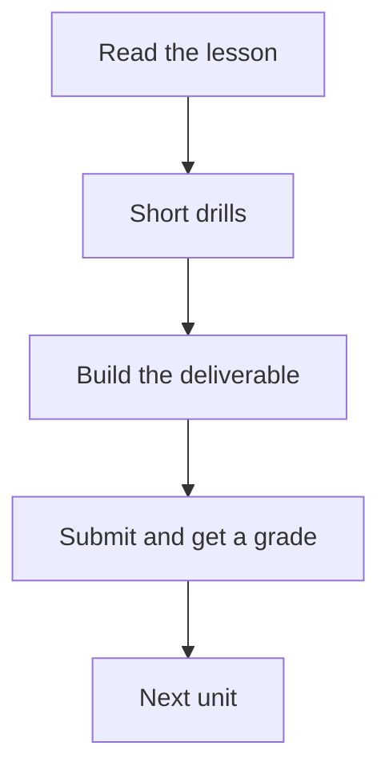

# Unit 0.2: How the curriculum and grading loop work

In the last unit you wrote one page about OmniCart. In this unit you read the map. Then you build a file that records every step.

::: phase learn

## The map you are standing in

You are in Phase 0. It has three units: 0.1, 0.2, and 0.3. You are in unit 0.2. That is this one. Unit 0.3 is next. It sets up the tools you need for Phase 1.

Let us zoom out. The whole curriculum has 13 phases, numbered 0 to 12. There is also a capstone at the end called Phase 12. Inside those 13 phases there are 56 modules in total. Each module is one unit.

```text
Phase 0  : Orientation            3 modules   (where you are)
Phase 1  : Software foundations   5 modules
Phase 2  : Model basics           4 modules
Phase 3  : Prompt design          5 modules   (includes 3.2.1)
Phase 4  : Retrieval              4 modules
Phase 5  : Agents                 5 modules
Phase 6  : Fine-tuning            4 modules
Phase 7  : Evaluation             4 modules
Phase 8  : Cost                   3 modules
Phase 9  : Security               4 modules
Phase 10 : Deployment             4 modules
Phase 11 : Business track         7 modules   (runs from day one)
Phase 12 : Capstone               4 modules
Total    : 56 modules across 13 phases
```

Phase 11 is different from the others. It runs from day one, not after you finish the technical phases. You will pair each technical phase with one business unit from Phase 11. This means the business and technical work grow together.

::: aside What Phase 11 is for
Phase 11 covers finding a niche, pricing your work, running discovery calls, and writing proposals. These are not extras after the real work. They are part of the work. Starting them early means they get real practice, not a last-minute sprint.
:::

::: recap The map
13 phases, 56 modules. Phase 11 runs alongside the rest from day one. Phase 0 is the only phase with no code.
:::

## The loop from reading to a grade


Every unit has four parts. First you read a lesson. Then you do short drills to see what stuck. Then you build something. Then you turn it in and get a grade.

The grade comes back in three steps. Step one is a set of checks that look for specific things in your file. For this unit, the checks look at the shape of your progress tracker. Step two is a review of your whole submission against a set of rules. Step three is a short defence where you explain one decision you made.

That is the grading loop. It is the same loop for every unit you will ever submit here. Once you see it here, you will recognise it every time.



::: aside Time-boxing each unit
Every unit has an estimate in hours. This unit says 0.5 hours, so plan for 30 minutes. When the time is up, stop and submit what you have. An early unit does not need to be perfect. A later phase builds on it. Moving forward and returning is better than getting stuck.
:::

## How to read a grade

When your submission comes back, you see one result for each criterion. A criterion is one specific thing the check looks for. For this unit there are four criteria. All four must pass.

If one fails, the result tells you what was wrong. You fix that one thing and try again. You do not re-do the whole submission. You fix the gap.

Here is the part that trips people up. The check looks at your file, not your effort. If the column name says "Time" instead of "Hours spent", the check fails. Read the rules once before you write, and read your own file once before you submit.

::: recap The grading loop
Read, drill, build, submit. You get a result for each criterion. Fix the one that failed. Resubmit. That is the whole loop.
:::

::: phase practice

## Read the Apex example before you build your own

Below, the app shows a finished progress tracker for a different company, Apex Freight Logistics. Read it once and read the notes under it. Then try the short drills to see whether the structure stuck.

::: route

::: worked-example

::: workbench

::: retrieval

::: phase build

## Build the file you will use for the whole program

Your file covers all 56 modules in 13 phases. One row per module. Four columns in this order.

```text
# OmniCart progress tracker

| Module | Status | Hours spent | Deliverable |
|--------|--------|-------------|-------------|
```

Save it as `omnicart-system/docs/progress-tracker.md`. This is the same `docs` folder where your client brief lives. Plan for about 30 minutes, and stop when the table is done.

::: deliverable

::: submission

::: phase verify

## Four checks, all four must pass

Four checks run on your file. All four must pass.

The exercise page lists the four checks in plain words. The grader quotes your own file back to you, so you can see exactly which row or column failed.

::: prove-it

::: grading-modes

::: rubric

::: phase unstuck

## When a part keeps going wrong

If one part of the file is causing trouble, the notes below cover the three most common snags.

::: unstuck

::: phase ask

## Questions to bring to the concierge

Ask about anything in this unit that is still unclear. For example, ask what to write for a unit you have not reached yet.

::: ask

::: coda One more column
The file you built has four columns. Think about what a fifth column could hold. Not a date. Not a number. Something that would help you remember why you paused on a unit. This is optional and does not change the four checks.
:::
